# Evidencias de Implementación

Este documento reúne la evidencia de ejecución del proyecto, requerida por el contrato ([contrato-proyecto.md](../contrato-proyecto.md)). Cada punto indica qué capturar, con qué comando/consulta generarlo, y dónde guardar la imagen (`images/`).

---

## 1. Tests automáticos

### 1.1 Suite completa (`cargo test`)


```powershell
cargo test
```

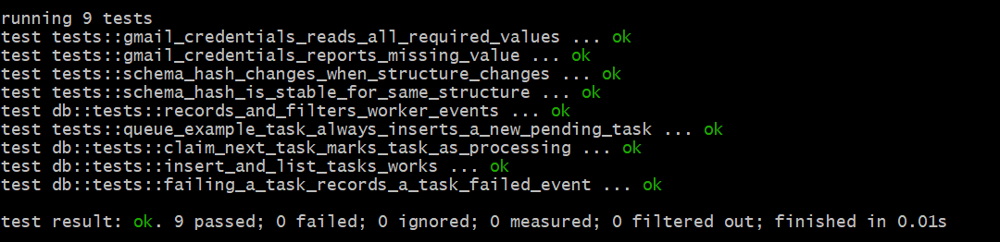


### 1.2 Tests puntuales por función


```powershell
cargo test schema_hash_is_stable_for_same_structure -- --nocapture
cargo test queue_example_task_always_inserts_a_new_pending_task -- --nocapture
cargo test gmail_credentials_reports_missing_value -- --nocapture
```

| Test | Qué demuestra |
|---|---|
| `schema_hash_is_stable_for_same_structure` | El hash de schema es determinístico ante la misma estructura (base del versionado) |
| `queue_example_task_always_inserts_a_new_pending_task` | `--queue-example` siempre encola una tarea nueva |
| `gmail_credentials_reports_missing_value` | El worker falla con un mensaje claro si falta una credencial OAuth |

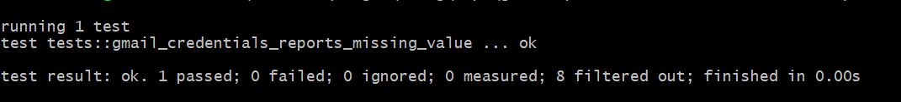

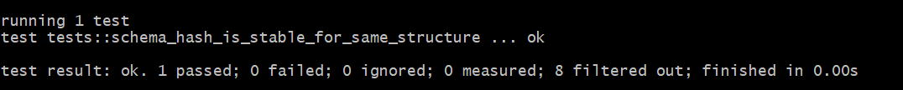

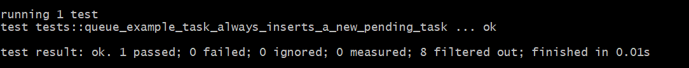


---

## 2. Flujo end-to-end contra Gmail API real

### 2.1 Inicialización y encolado

```powershell
cargo run -- --init-db
cargo run -- --queue-example
cargo run -- --list-tasks
```

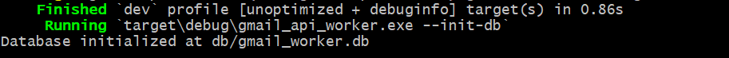

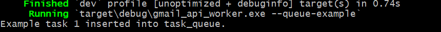

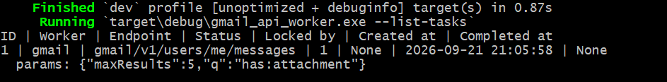

### 2.2 Procesamiento exitoso

```powershell
cargo run -- --process-one
```

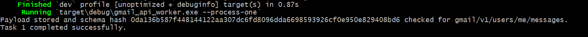


### 2.3 Estado final de la tarea

```powershell
cargo run -- --list-tasks
```

La tarea procesada debe figurar con `status = 3` (COMPLETED) y `completed_at` seteado.


---

## 3. Verificación directa en la base de datos (SQLite)

```sql
SELECT * FROM task_queue;
```
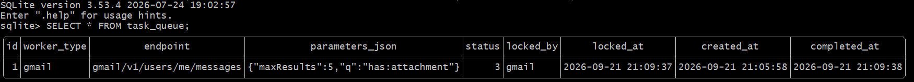

```sql
SELECT * FROM assets;
```
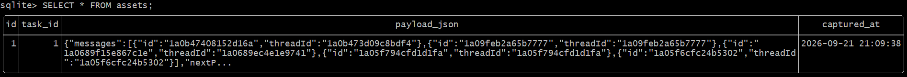


```sql
SELECT * FROM schema_versions;
```
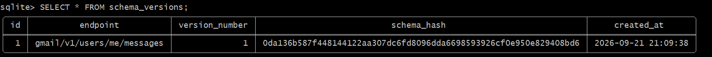


```sql
SELECT * FROM schema_snapshots;
```
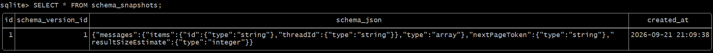


```sql
SELECT * FROM worker_events;
```
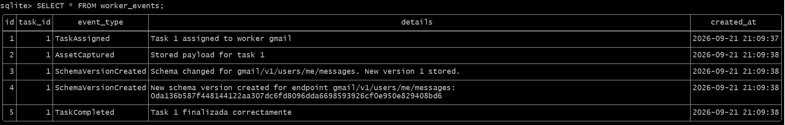


---

## 4. Idempotencia del versionado de schema

Encolar y procesar una segunda tarea con el mismo endpoint, y confirmar que **no** se crea una fila nueva en `schema_versions`:

```powershell
cargo run -- --queue-example
cargo run -- --process-one
```

```sql
SELECT COUNT(*) AS total_versiones FROM schema_versions WHERE endpoint = 'gmail/v1/users/me/messages';
```

El conteo debe mantenerse igual al de la ejecución anterior (mismo `schema_hash`), aunque `task_queue` sí tenga una fila nueva.

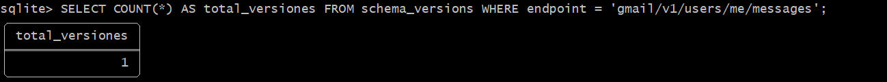


---

## 5. Manejo de errores

Editar temporalmente `.env` con un `GMAIL_CLIENT_SECRET` inválido, encolar y procesar una tarea:

```powershell
cargo run -- --queue-example
cargo run -- --process-one
```

Debe fallar con un mensaje tipo `OAuth token refresh failed (...)`, y la tarea debe quedar `status = 4` (FAILED) con un evento `TaskFailed` en `worker_events`. Restaurar el `.env` real después de la captura.

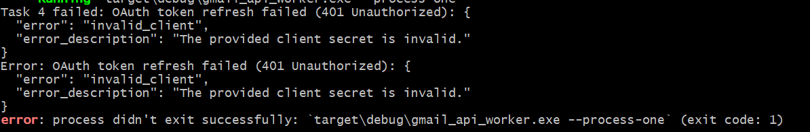

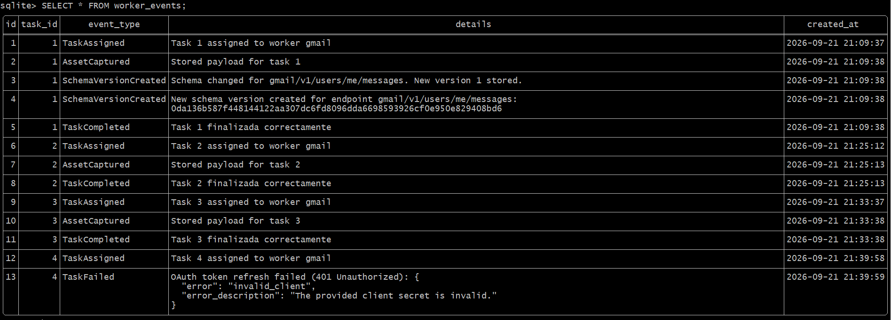


---

## 6. Control de concurrencia (dos procesos simultáneos)

Objetivo: demostrar que dos instancias del CLI corriendo al mismo tiempo **no** procesan la misma tarea dos veces (locking transaccional de `claim_next_task()`).

**Preparación:** encolar dos o más tareas pendientes:

```powershell
cargo run -- --queue-example
cargo run -- --list-tasks
```

**Ejecución simultánea:** abrir dos terminales PowerShell lado a lado y lanzar, lo más sincronizado posible, un `--process-one` en cada una:


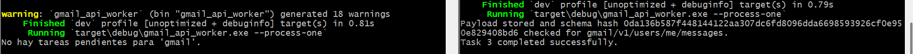

**Verificación:** cada tarea debe haber sido tomada por un único proceso, sin duplicados ni condiciones de carrera:

```sql
SELECT * FROM task_queue;
```

Confirmar que no hay dos tareas con el mismo `id` procesadas dos veces, y que cada una tiene un `locked_by` consistente con el worker que la completó.

[db - sin duplicados de asignación](../images/09-verificacion1.png)

```sql
SELECT task_id, event_type, created_at FROM worker_events
WHERE event_type = 'TaskAssigned'
ORDER BY id DESC LIMIT 5;
```

Debe haber exactamente un evento `TaskAssigned` por tarea (no dos), lo que confirma que el `UPDATE ... WHERE status = 1` evitó el doble procesamiento.

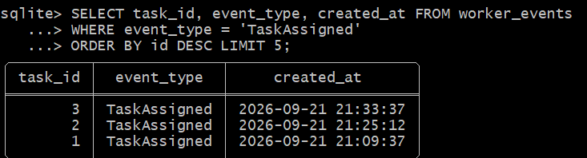


---

## 7. Modelo de datos

Diagrama entidad-relación de la base de datos:

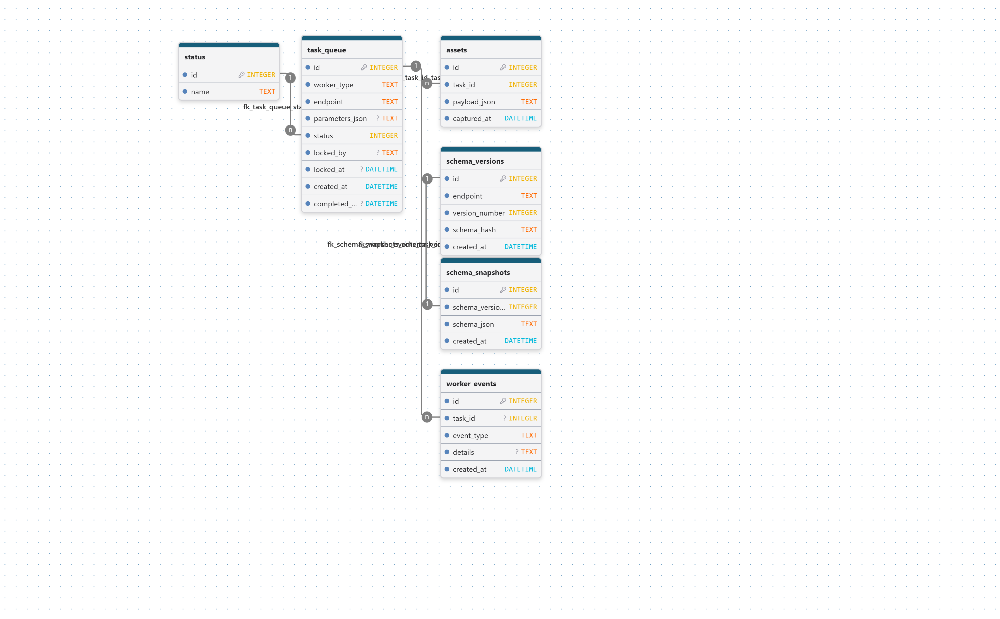


